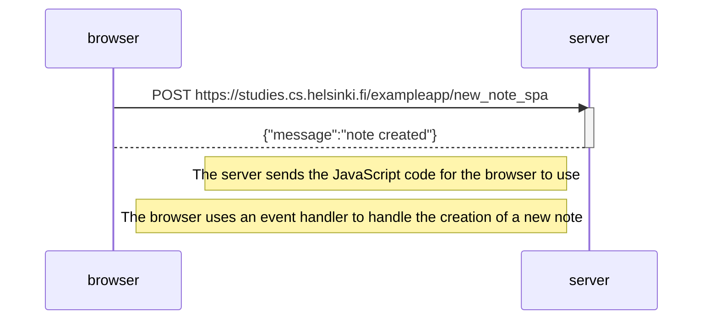

```mermaid
sequenceDiagram
    participant browser
    participant server

    browser->>server: POST https://studies.cs.helsinki.fi/exampleapp/new_note_spa
    activate server
    server-->browser: {"message":"note created"}
    deactivate server

    Note left of server: The server sends the JavaScript code for the browser to use
    Note right of browser: The browser uses an event handler to handle the creation of a new note
```
